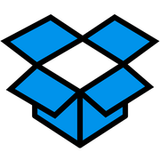
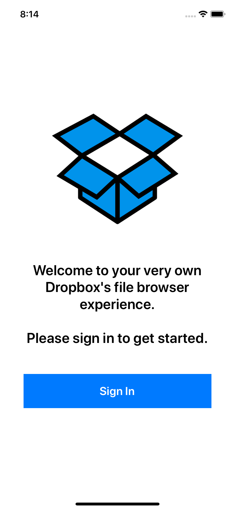
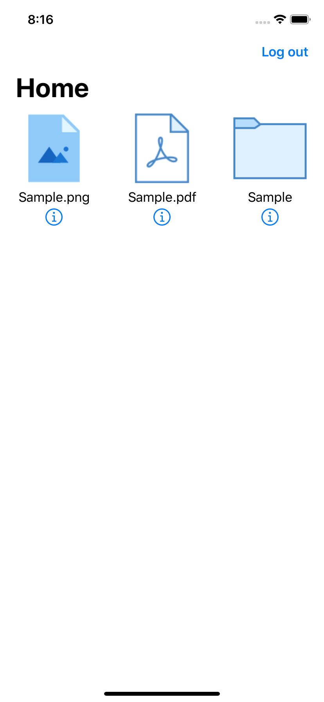
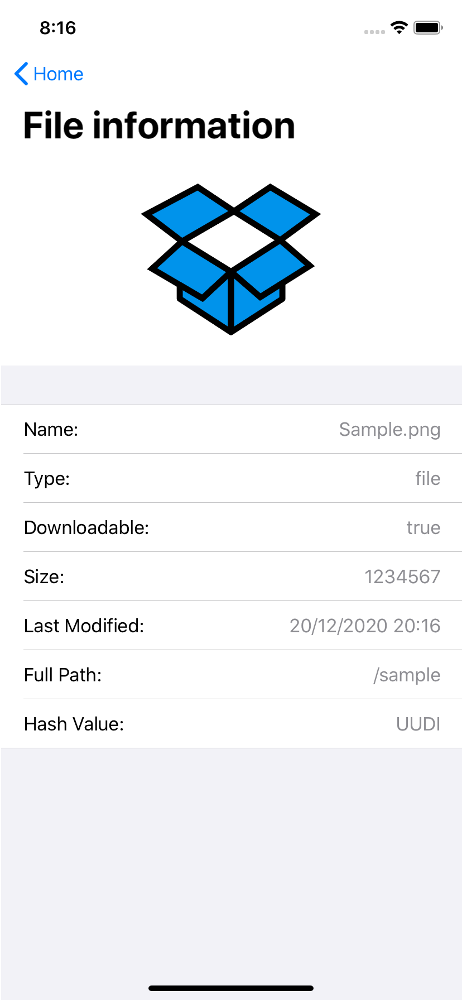

Made with ❤️ in Medellin, Colombia.

## Overview

<table>
  <tr>
    <th>
      
    </th>
    <th>
      
    </th>
    <th>
    
    </th>
    <th>
    
    </th>
  </tr>
</table>

## Setup

Clone project and then install dependencies using [Cocoapods](https://github.com/CocoaPods/CocoaPods) on the root of project:

`pod install`

## Features

* FileBrowser list
* FileImageViewer
* FilePDFViewer
* FileInformacionDetail + Thumbnail option
* Sign in with Dropbox account

### Architecture

* Clean + MVVM in presentation layer.
* RxSwift used for dataBinding between ViewController and ViewModel.
* Modules per feature + a common module called **Core**.
* Networking module for network services.
* We have interfaces for the repositories in order to respect the dependencies rule on the usecases,
as they should not be aware of the repositories impl that will be in an upper layer than usecases
* Unit test for main module (FileBrowser) in order to show how apply unit test for all other modules.
* UI Test to check the flow between modules.

## Built With

* [RxSwift](https://github.com/ReactiveX/RxSwift)
* [SwiftyDropbox](https://github.com/dropbox/SwiftyDropbox)
* [KeychainAccess](https://github.com/kishikawakatsumi/KeychainAccess)
* [SwifterSwift](https://github.com/SwifterSwift/SwifterSwift)
* [Lightbox](https://github.com/hyperoslo/Lightbox)
* [SkeletonView](https://github.com/Juanpe/SkeletonView)
* [DZNEmptyDataSet](https://github.com/dzenbot/DZNEmptyDataSet)
* [SVProgressHUD](https://github.com/SVProgressHUD/SVProgressHUD)

## Acknowledgments

App icons made by FreePick from www.flaticon.com